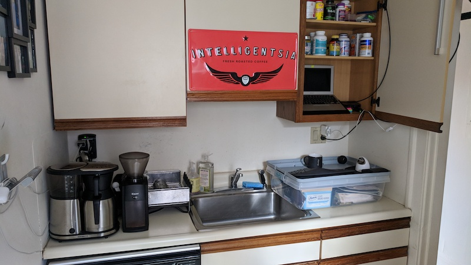
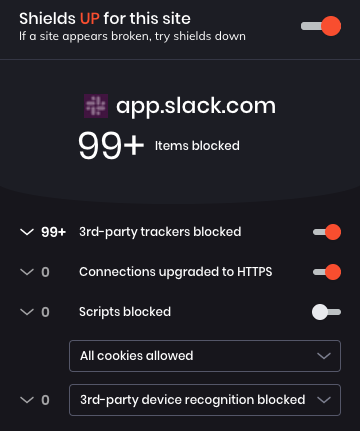

# Computer setup

Brendon Smith ([br3ndonland](https://github.com/br3ndonland))

## Table of Contents <!-- omit in toc -->

- [Description](#description)
- [Hardware](#hardware)
  - [Computer](#computer)
  - [Peripherals](#peripherals)
- [Operating system](#operating-system)
  - [macOS](#macos)
- [Setup](#setup)
  - [Strap](#strap)
  - [Package management](#package-management)
  - [PGP](#pgp)
  - [SSH](#ssh)
  - [Version control](#version-control)
  - [Language-specific setup](#language-specific-setup)
- [Settings](#settings)
  - [Fonts](#fonts)
  - [Shell](#shell)
  - [Terminal programs](#terminal-programs)
  - [Text editors](#text-editors)
  - [Data science IDEs](#data-science-ides)
  - [General productivity and social](#general-productivity-and-social)
  - [Media](#media)
  - [Science](#science)

## Description

This document describes my computer setup.

## Hardware

### Computer

| MacBook Air mid-2013 11" |                                |
| ------------------------ | ------------------------------ |
| Processor                | 1.7 GHz Intel Core i7          |
| Memory                   | 8 GB 1600 MHz DDR3             |
| Graphics                 | Intel HD Graphics 5000 1536 MB |

### Peripherals

- Keyboards
  - [Microsoft Sculpt ergonomic keyboard](https://www.amazon.com/dp/B00CYX26BC)
- Mice
  - [MOJO silent bluetooth vertical mouse](https://www.amazon.com/dp/B00K05LPIQ)
- Hard disks
  - Seagate backup plus slim external
  - Western Digital My Passport external
- AmazonBasics USB 3.0 hubs
- Plugable USB3-E1000 Gigabit Ethernet Adapter (drivers available [here](https://plugable.com/drivers/usb3ethernet/))
- [Blue Yeti Blackout](https://www.amazon.com/dp/B00N1YPXW2) microphone
- Accessories for standing work
  - When I first began standing work, I created a DIY standing desk in my kitchen:
    
    - I used my [Kensington SafeDock](https://www.amazon.com/dp/B008M11X0U) to elevate my MacBook in my kitchen cabinet, and wrapped the cable lock around a pipe near the ceiling.
    - I ran an ethernet cable from my router into the cabinet.
    - I added an [LED light](https://www.amazon.com/dp/B06Y3NWN8R) to the cabinet door.
  - I now have a [Fully Jarvis standing desk](https://www.fully.com/standing-desks/jarvis.html).
    
  - I also use a [SlingShot Hip Circle](https://markbellslingshot.com/collections/hip-circles), [compression socks](https://www.goldtoe.com/shop/mens/socks/gold-toe-mens-wellness-firm-compression-over-the-calf-socks-1-pair-3089), zero-drop shoes from [Altra](https://www.altrarunning.com/), and a [balance board](https://www.amazon.com/dp/B01MQJO2PQ), to improve my posture and endurance.

[(Back to top)](#top)

## Operating system

### macOS

- System Preferences: Dark mode, automatically hide and show the dock
- macOS now has the option to remap caps lock in _System Preferences -> Keyboard -> Modifier Keys_.
- [Karabiner Elements](https://pqrs.org/osx/karabiner/) can also be used for keymapping.

  - Simple modifications:

    | From key  | To key |
    | --------- | ------ |
    | caps_lock | escape |

  - Devices
    - Disable built-in keyboard when external keyboard is connected

[(Back to top)](#top)

## Setup

### Strap

#### Intro

- [Strap](https://github.com/MikeMcQuaid/strap) is a shell script to automate setup of a new machine for developers.
- In addition to the sensible essential defaults provided by Strap, the script can refer to two additional GitHub repositories, _USERNAME/dotfiles_ and _USERNAME/homebrew-brewfile_ for customizations. This dotfiles repository is meant to be used in conjunction with Strap.

#### Set up dotfiles

Dotfiles are configuration and settings files for applications.

In addition to settings, scripts can be stored in the dotfiles repo. There are three script options that Strap will check for. The scripts must be executable (`chmod +x`, execute permissions can be committed to version control with Git), stored in the dotfiles repo in _script/_, and named exactly for Strap to recognize them.

- _dotfiles/script/setup_
- _dotfiles/script/bootstrap_
- _dotfiles/script/strap-after-setup_
  - Runs _symlink.sh_.
    - Symlinks the dotfiles into the home directory, allowing the operating system to access the dotfiles in the default home directory, while also keeping the files in the Git repositories for version control.
    - Sets proper permissions on the GPG directories.
  - Runs _npm_globals.sh_
    - Installs global npm packages stored in _.npm/npm-globals.txt_
  - Runs _codium_extensions.sh_
    - Installs VSCode and VSCodium extensions.
  - Sets my shell to Zsh

#### Set up Homebrew Brewfile

- A Brewfile is a list of [Homebrew](https://brew.sh/) packages and casks that can be installed in a batch by [Homebrew Bundle](https://github.com/Homebrew/homebrew-bundle).
- The Brewfile can be used to install taps, packages, casks (applications), and even Mac App Store apps with the `mas` CLI. Note that you must sign in to the App Store ahead of time for `mas` to work.

#### Generate and run strap.sh

- There are several options for generating _strap.sh_.
- The web app is easiest, but Strap can also be set up locally.
- Strap is _idempotent_, meaning it can be run repeatedly on the same system.

### Package management

#### Homebrew

- Install [Homebrew](https://brew.sh/). Homebrew includes [Homebrew-Cask](https://caskroom.github.io/) to manage other macOS applications.
- See the Homebrew [docs](https://docs.brew.sh) for further info.
- My list of Homebrew packages and casks is available in my [homebrew-brewfile repo](https://github.com/br3ndonland/homebrew-brewfile), and engineered for use with [strap](https://github.com/MikeMcQuaid/strap).
- The Brewfile works with [Homebrew Bundle](https://github.com/Homebrew/homebrew-bundle) to manage all Homebrew packages and casks together.
- Key Brew Bundle commands:

  ```sh
  # Install everything in the Brewfile
  ~
  ❯ brew bundle install --global
  # Check for programs listed in Brewfile
  ~
  ❯ brew bundle check --global
  # Remove any Homebrew packages and casks not in Brewfile
  ~
  ❯ brew bundle cleanup --force --global
  ```

#### npm

- [node](https://nodejs.org/en/) is a JavaScript runtime. Install via Homebrew with `brew install node`.
- [npm](https://www.npmjs.com/) is a package manager written in node.js, included when node is installed.
- It's difficult to keep track of global npm packages. There's no easy way to do it with the usual _package.json_. As Isaac Schlueter [commented](https://github.com/npm/npm/issues/2949#issuecomment-11408461) in 2012,
  > Yeah, we're never going to do this.
- Instead, package names can be specified in a text file, and installed with a shell script. I based _./bin/_`npm_globals.sh` on a [similar install script](https://github.com/ianwalter/dotnpm/blob/master/install.sh), modified based on [SC2181](https://github.com/koalaman/shellcheck/wiki/SC2181).
- The _npm-globals.txt_ package list must not contain comments. Lines starting with `#` will throw npm errors.
- Global npm packages are then added to _/usr/local/lib/node_modules_.
- [npm-check](https://www.npmjs.com/package/npm-check) can be used to manage global packages after install, with `npm-check -u -g`. If not using npm-check, a list of global npm packages can be seen after installation with `npm list -g --depth=0`.

<details><summary>Legacy Anaconda info</summary>

#### Anaconda <!-- omit in toc -->

- I previously used [Anaconda](https://www.anaconda.com/) to manage my Python and R distributions, and now use Homebrew. I switched because Anaconda is a very large installation, not as flexible or general as Homebrew, and not as important for virtual environments now that we have Pipenv. Conda and brew could be seen as competing package managers.
- I install Anaconda by [direct download](https://www.anaconda.com/download/). I have also tried installing via Homebrew Cask, but didn't get the correct command prompt or path.
- Anaconda contains the [Conda](https://conda.io/docs/) and [PyPI](https://pypi.python.org/pypi) (pip) package managers. Packages can be installed from `pip`, and will integrate into the Anaconda environment.
- [Conda commands](https://conda.io/docs/commands):
  - Check installed packages with `$ conda list` and `$ pip list`.
  - Find packages with `$ conda search`.
  - Update conda with `$ conda update --prefix <PATH> anaconda`
  - Update packages with `$ conda update --all`

##### Additions to the standard Anaconda install <!-- omit in toc -->

- R and RStudio

  - When I was working with R, I preferred to install R and RStudio via Anaconda for easier version and package management. Otherwise, [R](https://cran.rstudio.com/) and [RStudio](https://www.rstudio.com) must be downloaded and installed separately. R cannot be updated from within RStudio, and installing a new R version can require reinstallation of packages. It's just too difficult to manage.

    ```sh
    $ conda install -c r r-essentials
    $ conda install rstudio
    ```

  - Packages (installed from within RStudio)
    - `calibrate`

</details>

[(Back to top)](#top)

### PGP

- I use [Gnu Privacy Guard](https://www.gnupg.org/) (GPG, the free implementation of Pretty Good Privacy (PGP)), [Keybase](https://keybase.io), and [ProtonMail](https://protonmail.com/) to encrypt and share messages, passwords, and other sensitive info.
- PGP vs SSL: SSL/TLS/HTTPS encrypts data in transit, but the storage provider like Dropbox, Google, or Slack can still read it. Communications which are end-to-end PGP encrypted can only be read by the sender or recipient, never the provider.

#### GPG

- GPG is an implementation of OpenPGP.

##### Installation and key generation

- Install `gpg` with a package manager:
  - Ubuntu: `sudo apt-get install gpg`
  - macOS: `brew install gpg`.
- Run `gpg --full-generate-key` from the command line to generate a key. Respond to the command-line prompts. The maximum key size of `4096` is recommended.
- View keys with `gpg --list-secret-keys`.
- Run `gpg --send-keys <keynumber>` to share the public key with the GPG database. It takes about 10 minutes for the key to show up in the GPG database.
- Export your GPG public key:
  - Copy to clipboard (for pasting into GitHub/GitLab): `gpg --armor --export | pbcopy`
  - Export to a file: `gpg --armor --export > public.gpg`

##### Sending messages

- Locate another user's key in the global database with `gpg --search-keys <email>`.
- Encrypting communications
  - Encrypt a message with `echo "Hello, World!" | gpg --encrypt --armor --recipient "<email>"`. Optionally, save the encrypted message in a .gpg file.
  - If the message was saved in a file, send the file over email, Slack, or any other medium.
  - Decrypt the message with `gpg --decrypt`.
    - If copying the text directly, include it in quotes: `echo "BIG LONG GPG STRING" | gpg --decrypt`.
    - If reading a file, include the filename when decrypting: `gpg --decrypt gcloud.gpg`.
    - Decrypted output can be autosaved to a new file: `gpg --decrypt gcloud.gpg --output file.txt`.

##### Signing Git commits with GPG

- See [Pro Git | 7.4 Git tools - signing your work](https://git-scm.com/book/en/v2/Git-Tools-Signing-Your-Work).
- Configure Git to use GPG and your key for commits, using _.gitconfig_:
  - Set `signingkey`: `git config --global user.signingkey 16digit_PGPkeyid` the 16 digit PGP key id is the partial 16 digit number listed on the `sec` line).
    ```ini
    [user]
    name = your name
    email = you@email.com
    signingkey = 16digit_PGPkeyid
    ```
  - Turn on `gpgsign`:
    ```ini
    [commit]
    gpgsign = true
    ```
- Configure GPG to allow Git commit signing with one of these options, depending on desired config:

  - Use `tty` (for command-line commits):
    - `tty` is a back-end service used by GPG to pass information through the program. See the [GPG Agent Options docs](https://www.gnupg.org/documentation/manuals/gnupg/Agent-Options.html) for more.
    - Export the `GPG_TTY` environment variable: `export GPG_TTY=$(tty)`
    - Can add to shell profile to automatically export
  - Disable `tty` and use `pinentry` (for commits in VSCode or other IDE):

    - Install `pinentry` with package manager:
      - macOS: `brew install pinentry-mac`
      - Ubuntu Linux: `apt install pinentry`
    - Update GPG config files:
      - _~/.gnupg/gpg.conf:_ `no-tty`
      - _~/.gnupg/gpg-agent.conf:_ `pinentry-program /usr/local/bin/pinentry-mac`
    - Ensure proper permissions are set on GPG config files:
      ```sh
      chmod 700 ~/.gnupg
      chmod 600 ~/.gnupg/gpg.conf
      ```

- Trust GPG keys using the GPG TTY interface:
  - If you see `gpg: WARNING: This key is not certified with a trusted signature!` when examining signed Git commits with `git log --show-signature`, you may want to trust the keys.
  - Enable `tty` if you previously disabled it (comment out `no-tty` in _~/.gnupg/gpg.conf_).
  - Enter the GPG key editor from the command line with `gpg --edit-key <PGPkeyid>`.
  - Set trust level for the key by typing `trust`, and entering a trust level.
  - See the [GPG docs](https://www.gnupg.org/gph/en/manual/x334.html) for more info.
- [GitHub GPG instructions](https://help.github.com/articles/signing-commits-with-gpg/)
- [GitLab GPG instructions](https://gitlab.com/help/user/project/repository/gpg_signed_commits/index.md)

#### Keybase

##### Useful features

- **PGP key and identity management** (see [below](#keybase-pgp))
- **Chat** (see [below](#keybase-chat))
- **Teams**: see blog posts on [teams](https://keybase.io/blog/introducing-keybase-teams) and [updates to teams](https://keybase.io/blog/new-team-features).
- **Encrypted files**: Keybase file system (KBFS). Like an encrypted Dropbox or Google Drive cloud storage system. Integrates with the macOS finder through use of the [FUSE for macOS](https://osxfuse.github.io/) package.
- Git (see [below](#keybase-git))
- See [Keybase docs](https://keybase.io/docs) for more.

##### Keybase PGP

- **Keybase solves the key identity problem.**
  - Even if you have someone's public PGP key, you can't verify it actually came from them unless you exchange it in person.
  - Keybase provides a unified identity for verification of PGP keys. Each device gets its own private key, and they share identity.
  - It was previously challenging to move PGP keys among devices, but now it can be accomplished simply by signing in to Keybase.
- Manage GPG/PGP keys in Keybase from the command line with `keybase pgp`.
- Generate a new PGP key with `keybase pgp gen`. If you already have a key, add the `--multi` flag, like `keybase pgp gen --multi`.
- List keys with `keybase pgp list`.
- View a public key with `keybase pgp export`. If you have multiple keys, specify the key with `keybase pgp export -q <key_id>`.
- Export Keybase PGP key for use with GPG:

  ```sh
  # Public key
  keybase pgp export -q 16digit_PGPkeyid | gpg --import
  # Private key
  keybase pgp export -q 16digit_PGPkeyid --secret | gpg --allow-secret-key-import --import
  ```

- [Following](https://keybase.io/docs/server_security/following) someone is a way of verifying their cryptographic identity, not a way of subscribing to updates from the person like social media. I think calling this "following" is confusing. It's really more like verifying.
- Keybase uses the [NaCl](https://nacl.cr.yp.to/) (salt) library for encryption, which turned out to be a great choice. It's been stable and has avoided vulnerabilities. They also used Go to build many of the features.
- The Keybase database is represented as a merkle tree. See [Keybase docs: server security](https://keybase.io/docs/server_security) and [Wikipedia](http://en.wikipedia.org/wiki/Merkle_tree).
- Keybase doesn't directly run on blockchain, but they do [push the Keybase merkle root to the Bitcoin blockchain](https://keybase.io/docs/server_security/merkle_root_in_bitcoin_blockchain) for verification.
- The [Software Engineering Daily podcast episode with Max Krohn from 2017-10-24](https://softwareengineeringdaily.com/2017/10/24/keybase-with-max-krohn/) has more helpful explanation.

##### Keybase chat

**Keybase chat looks and feels like Slack, but has several advantages.**

- [Keybase is open-source](https://github.com/keybase/client). Slack is not.
- [Keybase chat is end-to-end encrypted](https://keybase.io/docs/chat/index). Slack is not.
- Keybase chat does not have a free message limit. Slack does. I frequently hit this free message limit when participating in large workspaces for my courses on Udacity, and it negatively impacted my ability to build projects with classmates. We switched to a Keybase team instead.
- Keybase has not leaked passwords. [Slack has been vulnerable to password leaks and other attacks](https://slackhq.com/march-2015-security-incident-and-the-launch-of-two-factor-authentication), and it took Slack four years before they notified users. [The Keybase CEO's Slack credentials were compromised](https://keybase.io/blog/slack-incident).
- Keybase does not use third-party trackers. Slack is polluted with trackers. Here's a screenshot of the [Brave browser](https://brave.com/) blocking Slack trackers during a typical session in the Slack workspace used in my previous developer job:
  

##### Keybase Git

- Keybase allows users and teams to create and store end-to-end encrypted Git repositories. See the [Keybase Git docs](https://keybase.io/docs/git/index) and [Keybase Git blog post](https://keybase.io/blog/encrypted-git-for-everyone).
- Treat Keybase Git repos as [remotes](https://git-scm.com/book/en/v2/Git-Basics-Working-with-Remotes) (like GitHub repos). They can be cloned, pushed, and pulled, as you would do for GitHub repos.

  ```sh
  git remote add keybase keybase://$PUBLIC_OR_PRIVATE/$USERNAME/$REPONAME
  git push keybase
  ```

- As of Keybase 5.1.0, [Git LFS](https://git-lfs.github.com/) is also enabled.
- Keybase can't yet be used to directly sign Git commits, as described [above](#signing-git-commits-with-gpg). The best method, as described [here](https://github.com/pstadler/keybase-gpg-github), is to export your PGP key from Keybase to GPG, and then sign Git commits with GPG. Eventually, I would like to set Keybase as the signing program in my _~/.gitconfig_ and skip the export to GPG.

  - _.gitconfig_ for GPG

    ```ini
    ...
    [commit]
    gpgsign = true
    [gpg]
    program = gpg
    ...
    ```

  - _.gitconfig_ for Keybase?

    ```ini
    ...
    [commit]
    pgpsign = true
    [pgp]
    program = keybase
    ...
    ```

- There has been some debate about the need to sign Git commits at all. Linus Torvalds has [recommended](http://git.661346.n2.nabble.com/GPG-signing-for-git-commit-td2582986.html) the use of `git tag -s` to sign with tags instead. The Keybase developers [sign releases with tags, but don't always sign commits](https://github.com/keybase/client/issues/3318) to the Keybase source code. However, in order to sign tags, you still need to export the PGP key. Whether you sign all commits or just tags, Keybase should improve this feature.

#### ProtonMail

I use [ProtonMail](https://protonmail.com/) for PGP-encrypted email.

### SSH

#### Generate SSH key

- [Generate an SSH key and add it to the SSH agent](https://help.github.com/articles/generating-a-new-ssh-key-and-adding-it-to-the-ssh-agent/)

  ```sh
  $ touch ~/.ssh/config
  $ ssh-keygen -t rsa -b 4096 -C "your_email@example.com"
  $ eval "$(ssh-agent -s)"
  $ ssh-add -K ~/.ssh/id_rsa
  ```

  - The config file may need to be manually created with `touch ~/.ssh/config` first.

#### GitHub SSH

[Connecting to GitHub with SSH](https://help.github.com/articles/connecting-to-github-with-ssh/) allows your computer to send information to GitHub over an SSH connection, so you can push changes without having to provide your username and password every time. These steps should only need to be performed once. These steps will allow your computer to connect to GitHub with SSH, and should only need to be performed once for each machine.

- [Add SSH key to GitHub account](https://help.github.com/articles/adding-a-new-ssh-key-to-your-github-account/)

  ```sh
  $ pbcopy < ~/.ssh/id_rsa.pub
  ```

  - Go to GitHub and paste the key.

- [Check SSH connection](https://help.github.com/articles/testing-your-ssh-connection/)

  ```sh
  $ ssh -T git@github.com
  ```

  - Verify it looks similar to the link above, type `yes`, verify username.
  - The above steps should only need to be done once.

### Version control

#### Git

- Install via Homebrew

  ```sh
  brew install git
  ```

- [Connect to GitHub with SSH](https://help.github.com/articles/connecting-to-github-with-ssh/)

[(Back to top)](#top)

### Language-specific setup

#### JavaScript

##### Global npm packages

See [npm](#npm) section above.

##### Formatting

- I use the [Prettier](https://prettier.io/) autoformatter and the [Prettier VSCode extension](https://marketplace.visualstudio.com/items?itemName=esbenp.prettier-vscode) to format my web code, including JavaScript and Vue.js. Prettier is an extremely helpful productivity tool, and I highly recommend it. Autoformatters save time and prevent [bikeshedding](https://www.freebsd.org/doc/en/books/faq/misc.html#idp50244984).
- ESLint notes:

  - Compared with Prettier, ESLint formats less code languages, requires complicated setup, and doesn't work well when installed globally. I previously attempted to use a global ESLint installation with the [VSCode ESLint extension](https://marketplace.visualstudio.com/items?itemName=dbaeumer.vscode-eslint), but was getting errors about plugins. As the ESLint docs explain:
    > It is also possible to install ESLint globally rather than locally (using `npm install eslint --global`). However, this is not recommended, and any plugins or shareable configs that you use must be installed locally in either case.
  - The errors persist even after specifying the path to global npm packages:

    ```jsonc
    // VSCode settings.json
    {
      "eslint.nodePath": "/usr/local/lib/node_modules"
    }
    ```

  - If ESLint and plugins are installed in the project directory, the following settings can be added to the VSCode _settings.json_, for use with the [VSCode ESLint extension](https://marketplace.visualstudio.com/items?itemName=dbaeumer.vscode-eslint)and [eslint-plugin-vue](https://eslint.vuejs.org/user-guide/). I typically don't use ESLint to auto-fix files, because Pretter is preferred.

    ```jsonc
    // VSCode settings.json
    {
      "eslint.autoFixOnSave": false,
      "eslint.enable": true,
      "eslint.validate": ["javascript", "javascriptreact", "vue"]
    }
    ```

  - I do still retain a global _.eslintrc_ in my dotfiles repo, because it is a useful template for sensible defaults.

- In the past, I also used [JavaScript Standard Style](https://standardjs.com/) (aka StandardJS). Standard Style has also [reportedly](https://changelog.com/podcast/359) been favored by Brendan Eich (creator of JavaScript) and Sir Tim Berners-Lee (creator of the World Wide Web). Prettier provides a similar code style, but with more features, so I use Pretter instead.

#### Python

- I recommend installing `python3` and `pipenv` with Homebrew. After installing `python3`, `pip` can be updated with `pip3 install --upgrade pip setuptools wheel`.
- **I format Python code with [Black](https://black.readthedocs.io/en/stable/).**
  - VSCode provides built-in support for Black. I set VSCode to autoformat on save.
  - Black is still considered a pre-release, and Pipenv may throw some errors. Allow pre-releases in the _Pipfile_ with `pipenv install --pre`, and install Black with a `--dev` flag with `pipenv install black --dev`
  - If you prefer the less-decisive PEP 8 format, I recommend [autopep8](https://pypi.org/project/autopep8/) for autoformatting. VSCode also has built-in [Python formatting](https://code.visualstudio.com/docs/python/editing#_formatting) support for autopep8.
- See my [template-python](https://github.com/br3ndonland/template-python) repo for useful tooling and additional sensible defaults.

[(Back to top)](#top)

## Settings

### Fonts

- [Dank Mono](https://dank.sh/) font
- [IBM Plex Mono](https://github.com/IBM/plex)
- [Ubuntu Mono](https://design.ubuntu.com/font/)

### Shell

- Zsh

  - Like Bash with more features. See the Wes Bos [Command Line Power User course](https://commandlinepoweruser.com/) for a tutorial. There is a version included with macOS, but it may be out of date.
  - Install via Homebrew:

    ```sh
    brew install zsh zsh-completions
    ```

- [Pure prompt](https://github.com/sindresorhus/pure)

  - Install from npm:

    ```sh
    npm install --global pure-prompt
    ```

  - Add the prompt to _~/.zshrc_:

    ```zsh
    # .zshrc continues above
    autoload -U promptinit; promptinit
    prompt pure
    # .zshrc continues below
    ```

- [zsh-syntax-highlighting](https://github.com/zsh-users/zsh-syntax-highlighting)
  - Install with Homebrew.
  - Activate the plugin in _~/.zshrc_:
    - Open _~/.zshrc_ from the command line with `code ~/.zshrc`.
    - Source the script at the end: `source /usr/local/share/zsh-syntax-highlighting/zsh-syntax-highlighting.zsh`
- [trash-cli](https://github.com/sindresorhus/trash-cli): Moves files to the trash instead of permanently deleting with `rm`.
- For my terminal applications, I use:
  - [iTerm2](https://iterm2.com) and the [snazzy](https://github.com/sindresorhus/iterm2-snazzy), [dracula](https://draculatheme.com/), or [palenight](https://github.com/JonathanSpeek/palenight-iterm2) themes
  - [Hyper](https://hyper.is/) and the [hyper-snazzy](https://github.com/sindresorhus/hyper-snazzy) or [dracula](https://draculatheme.com/) themes.
  - [VSCode integrated terminal](https://code.visualstudio.com/docs/editor/integrated-terminal)

<details><summary>Previous bash prompt</summary>

I used the Udacity Git prompt configuration. Command prompt installation instructions:

1. Download and unzip [udacity-terminal-config.zip](http://video.udacity-data.com.s3.amazonaws.com/topher/2017/March/58d31ce3_ud123-udacity-terminal-config/ud123-udacity-terminal-config.zip)
2. Move the directory `udacity-terminal-config` to your home directory and rename to `.udacity-terminal-config` (add a leading dot).
3. Move the `bash_profile` file to your home directory and name it `.bash_profile` (add a leading dot).
   - If you already have a `.bash_profile` file in your home directory, copy the text from the downloaded `bash_profile` and paste in your existing `.bash_profile`.
4. See the [free Git course](https://www.udacity.com/course/version-control-with-git--ud123) for more info.

</details>

### Terminal programs

#### Hyper

- [Hyper](https://hyper.is/) is a cross-platform open-source command line interface, configurable with HTML/CSS/JS.
- Settings are in _~/.hyper.js_.

#### iTerm2

- [iTerm2](https://www.iterm2.com/) is a powerful command line interface for macOS only.
- Preferences
  - General
    - Disable confirm quit
  - Appearance
    - Theme: Dark
  - Keys
    - Hotkey: Cmd+Esc
  - Profiles:
    - Colors
      - Color Presets
        - [Dracula](https://draculatheme.com/iterm/)
        - [Palenight](https://github.com/JonathanSpeek/palenight-iterm2)
        - [Snazzy](https://github.com/sindresorhus/iterm2-snazzy)
        - Solarized dark
    - Dank Mono font, size 18
    - Settings for new windows: 80x24, normal

### Text editors

#### Sublime Text <!-- omit in toc -->

I no longer use Sublime Text.

<details><summary>Packages</summary>

Install [Sublime Text](https://www.sublimetext.com/), install Package Control, then install other packages from the command palette with "Package Control: Install Package."

- Anaconda
- Babel
- Base16 Color Schemes
- Color Highlighter
- Emmet
- GitGutter
- GitSavvy: Useful for git commits, but I have not been able to successfully configure git push for ssh. I just use a terminal or GitHub Desktop to push.
- GitStatusBar
- LiveReload
- MarkdownEditing
- MarkdownLivePreview: Currently has some issues with lack of wrapping in the previews. See [GitHub Issue tracker](https://github.com/math2001/MarkdownLivePreview/issues/34).
- Markdown Preview
- Package Control
- SideBarEnhancements
- SublimeLinter
  - [SublimeLinter-contrib-standard](https://packagecontrol.io/packages/SublimeLinter-contrib-standard) and [StandardFormat](https://packagecontrol.io/packages/StandardFormat) (for [JavaScript Standard Style](https://standardjs.com/), requires standard installed via npm)
  - [Sublime​Linter-eslint](https://packagecontrol.io/packages/SublimeLinter-eslint) ([ESLint](https://eslint.org/) with JavaScript AirBnB style, requires eslint installed via npm)

</details>

<details><summary>Settings and preferences</summary>

<details><summary>Color scheme: Mariana</summary>

- I like `Mariana` for everything. Note that the default color schemes in Sublime have enhancements like italicizing class names and functions, bolding Markdown headers, and differentially shading Markdown code fences, that the Base16 color schemes do not have.
- [Base16](https://github.com/chriskempson/base16-textmate) color schemes are available via Package Control. To install manually:

  ```sh
  cd ~/Library/Application\ Support/Sublime\ Text\ 3/Packages
  git clone git://github.com/chriskempson/base16-textmate.git Base16
  ```

- Base16 color schemes I like:
  - `ashes` (pastels)
  - `atelier-sulphurpool` (similar to cobalt, but easier on the eyes)
  - `flat` (very similar to atelier-sulphurpool and cobalt, but slightly more readable)
  - `harmonic-dark`
  - `nord`
  - `ocean`
  - `solarized-dark`
  - `tomorrow-night` (like a muted monokai)
  - `tomorrow-night-eighties`

</details>

<details><summary>Theme: Adaptive</summary>

`Adaptive` (included with Sublime Text 3).

The [Material theme](https://packagecontrol.io/packages/Material%20Theme) is great if you want something different, but has been deprecated after the developer switched to Atom (note this is happening with other popular packages like [JavaScript Beautify](https://packagecontrol.io/packages/Javascript%20Beautify)).

</details>

- Anaconda.sublime-settings

  ```json
  {
    "swallow_startup_errors": true,
    "pep8_ignore": ["E128"],
    // Maximum line length for pep8
    "pep8_max_line_length": 100
  }
  ```

- CSS.sublime-settings, HTML.sublime-settings, JavaScript.sublime-settings, JSON.sublime-settings

  ```json
  {
    "tab_size": 2,
    "translate_tabs_to_spaces": true
  }
  ```

- Markdown.sublime-settings

  ```json
  {
    "color_scheme": "Packages/Color Scheme - Default/Mariana.tmTheme",
    "tab_size": 2,
    "translate_tabs_to_spaces": false
  }
  ```

- MarkdownPreview.sublime-settings

  - Italic markers set to stars instead of underscores, to avoid conflicts with underscores in file names, in Preferences -> Package Settings -> Markdown Editing -> Copy from Bold and Italic Settings - Default to Bold and Italic Settings - User, change `__` and `_` to `**` and `*`.

  ```json
  {
    "browser": "firefox",
    "github_inject_header_ids": true,
    "enable_autoreload": true
  }
  ```

- Preferences.sublime-settings

  ```json
  {
    "theme": "Adaptive.sublime-theme",
    "color_scheme": "Packages/Color Scheme - Default/Mariana.tmTheme",
    "font_face": "Ubuntu Mono",
    "font_size": 18,
    "ignored_packages": ["Vintage"],
    "trim_trailing_white_space_on_save": true
  }
  ```

- Python.sublime-settings

  ```json
  {
    "highlight_line": true,
    "rulers": [72, 79, 100],
    "tab_size": 4,
    "translate_tabs_to_spaces": true
  }
  ```

- SublimeLinter.sublime-settings

  ```json
  // SublimeLinter Settings - User
  {
    "linters": {
      "standard": {
        "disable": false
      },
      "eslint": {
        "disable": true
      }
    },
    "paths": {
      "osx": ["~/usr/local/bin/standard"]
    }
  }
  ```

</details>

<details><summary>Key bindings</summary>

```json
[
  { "keys": ["ctrl+pagedown"], "command": "next_view_in_stack" },
  { "keys": ["ctrl+pageup"], "command": "prev_view_in_stack" },
  { "keys": ["ctrl+tab"], "command": "next_view" },
  { "keys": ["ctrl+shift+tab"], "command": "prev_view" }
]
```

</details>

#### VSCodium

- I write code with [VSCodium](https://github.com/VSCodium/vscodium), an alternate build of [Microsoft Visual Studio Code](https://code.visualstudio.com/) (VSCode) that is fully FLOSS (free, libre open-source software) and free of telemetry.
- I sometimes still use VSCode for the [remote development features](https://code.visualstudio.com/docs/remote/remote-overview), to work on servers via SSH. I'm considering [Pony SSH](https://github.com/thingalon/pony-ssh) for use with VSCodium.
- I used to configure VSCode and VSCodium using the [Settings Sync](https://marketplace.visualstudio.com/items?itemName=Shan.code-settings-sync) extension. I now have my settings, keybindings, and extensions stored here in my dotfiles repo. Extensions can be installed by running _codium_extensions.sh_ along with the name of the editor, like `codium_extensions.sh codium`. The shell script was quite easy to write. I based it on _npm_globals.sh_, and used the [VSCode extension CLI](https://code.visualstudio.com/docs/editor/extension-gallery).

[(Back to top)](#top)

### Data science IDEs

#### JupyterLab

I would suggest using [JupyterLab](https://jupyterlab.readthedocs.io/en/stable/) within a Pipenv virtual environment. I use the [Homebrew](https://brew.sh) package manager on macOS to install Python 3, the [Pipenv](https://pipenv.readthedocs.io/en/latest/) virtual environment tool, and [Jupyter](https://jupyter.org). Here are some setup instructions:

- I [install JupyterLab](https://jupyterlab.readthedocs.io/en/stable/getting_started/installation.html) with Pipenv.
- Install Homebrew from the command line as described on the [Homebrew website](https://brew.sh).
- After installing Homebrew, install the necessary Homebrew packages from the command line:

  ```sh
  brew install python3
  brew install pipenv
  brew install jupyter
  ```

- Once installation is complete, navigate to your project's directory, install dependencies, and run JupyterLab. Here are the necessary command line arguments:

  ```sh
  brew install python3
  brew install pipenv
  brew install jupyter
  cd path/where/you/want/jupyterlab
  # On first install: pipenv install jupyterlab requests numpy statistics twilio
  # After Pipfile is generated
  pipenv install
  pipenv shell
  # Install any JupyterLab extensions at this point
  (pipenv) $ jupyter labextension install @jupyterlab/toc
  (pipenv) $ jupyter lab
  ```

I previously used [Anaconda](https://www.anaconda.com/) to manage my Python and R distributions, and now use Homebrew. I switched because Anaconda is not as flexible or general as Homebrew, not as important for virtual environments now that we have Pipenv, and is a very large installation that is difficult to manage and uninstall.

<details><summary>Previous Jupyter Notebook configuration</summary>

- Launch from command line with

  ```sh
  $ jupyter notebook
  ```

- Update with

  ```sh
  $ conda update -a
  ```

- [Jupyter notebook extensions manager](https://github.com/ipython-contrib/jupyter_contrib_nbextensions)
- Install with

  ```sh
  $ conda install -c conda-forge jupyter_contrib_nbextensions
  ```

- [jupyter-themes](https://github.com/dunovank/jupyter-themes)

  - Install with

    ```sh
    pip install jupyterthemes
    ```

  - settings:

    ```sh
    jt -t chesterish -f ubuntu -fs 14 -altp -tfs 16 -nf sourcesans -nfs 16 -ofs 12 -cellw 88% -T
    ```

  - To update settings, shutdown jupyter notebook kernel, clear browser cache, restart browser, restart jupyter notebook

- [Jupyter Notebook Table of Contents extension for Markdown headers](https://github.com/minrk/ipython_extensions)
- [jupyter version control with nbdime](http://nbdime.readthedocs.io/en/latest/)

  - May already be installed through anaconda. to check, enter `conda list` at the command line.
  - Install with

    ```sh
    pip install nbdime
    ```

  - Enable with

    ```sh
    nbdime config-git --enable --global
    ```

  - (can also enable for individual repositories).

- Add [jupyter .gitignore](https://github.com/jupyter/notebook/blob/master/.gitignore) to directory (or to \$HOME/.config/git/ignore for global configuration), to avoid recognizing notebook checkpoint files.
- \*_Comments:_- Jupyter Notebook is great, but lacks many of the features of Sublime Text, like the PEP 8 linting in the Anaconda package (ironically, considering JupyterLab is made by Anaconda), and the Markdown autocompletion of the MarkdownEditing package. Sublime doesn't run code chunks like Jupyter or RStudio do though.

</details>

#### RStudio

- Installed via Homebrew
- Modern RStudio theme
- Material editor theme
- Dank Mono font
- In R Markdown options, check "Show document outline by default."

[(Back to top)](#top)

### General productivity and social

- [1Password](https://1password.com/) (Homebrew Cask or Mac App Store)
- Adobe Acrobat
- [Backblaze](https://www.backblaze.com/) (Homebrew Cask)
- [Bear](https://bear.app) (Mac App Store)
- [Firefox Developer Edition](https://www.mozilla.org/en-US/firefox/developer/) (Homebrew Cask)
  - Use Firefox account to sync preferences and add-ons.
- macOS Keynote, Numbers, and Pages
- [ProtonVPN](https://protonvpn.com/) (Homebrew Cask)

[(Back to top)](#top)

### Media

- [Audacity](https://www.audacityteam.org/)
- [HandBrake](https://handbrake.fr/)
- [Plex](https://www.plex.tv/) media server
- [VLC](https://www.videolan.org/vlc/) media player

[(Back to top)](#top)

### Science

- [Zotero](https://www.zotero.org/)

[(Back to top)](#top)
